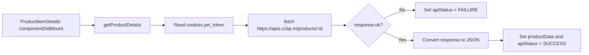
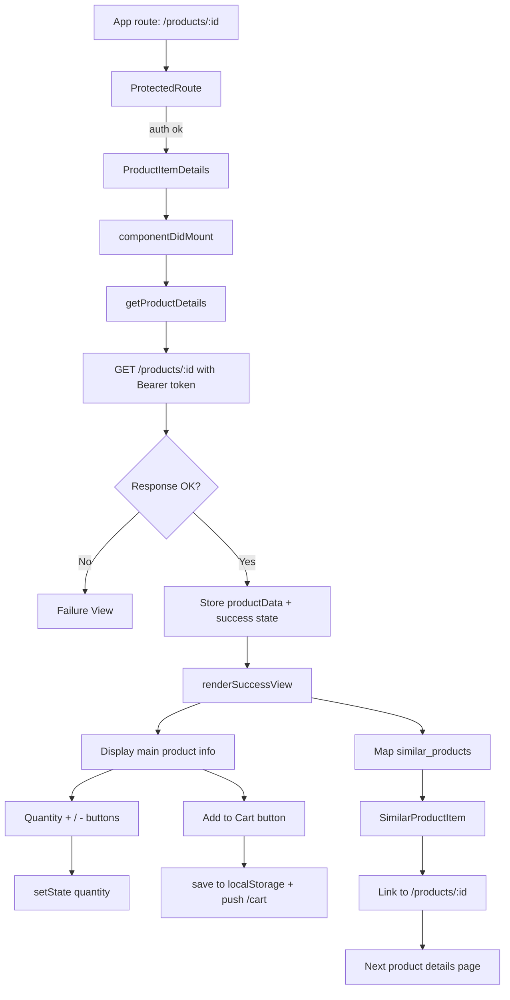

# Product Item Details Flow

This document explains how the `ProductItemDetails` component and the `SimilarProductItem` component work together in the product details feature.

## 1) Parent-child relationship

- `ProductItemDetails` is the main parent component for the route `/products/:id`.
- It fetches the selected product data and renders the current product details.
- It passes each similar item to `SimilarProductItem` as a prop named `productData`.
- `SimilarProductItem` is a presentational child component. It does not manage its own state.

## 2) Route and auth flow

```mermaid
flowchart TD
    A[User clicks product card in Products route] --> B[Link to /products/:id]
    B --> C[ProtectedRoute checks jwt_token]
    C -->|token missing| D[Redirect to /login]
    C -->|token present| E[ProductItemDetails mounts]
    E --> F[componentDidMount() -> getProductDetails()]
```

Important points:

- The route is protected by `ProtectedRoute`.
- `jwt_token` must exist in cookies; otherwise redirect to `/login`.
- Once the page loads, `ProductItemDetails` reads the route parameter `match.params.id`.

## 3) State inside ProductItemDetails

```jsx
state = {
  productData: null,
  quantity: 1,
  apiStatus: apiStatusConstants.initial,
}
```

### State meaning

- `productData`: stores the selected product and its `similar_products` array.
- `quantity`: controls the quantity to add to cart. It starts at `1`.
- `apiStatus`: tracks the request lifecycle:
  - `INITIAL`
  - `IN_PROGRESS`
  - `SUCCESS`
  - `FAILURE`

## 4) API call flow

The component fetches the product using the product id in the URL.



### Request details

```js
fetch(`https://apis.ccbp.in/products/${match.params.id}`, {
  headers: {Authorization: `Bearer ${jwtToken}`},
  method: 'GET',
})
```

### What the API returns

- product details like `title`, `price`, `description`, `brand`, `rating`, etc.
- a `similar_products` array
- if the product is missing, the response is unsuccessful and the failure view is shown

## 5) Loading, success, and failure rendering

```mermaid
flowchart TD
    A[apiStatus = INITIAL] --> B[Render nothing extra]
    C[apiStatus = IN_PROGRESS] --> D[Loader shown]
    E[apiStatus = SUCCESS] --> F[renderSuccessView()]
    G[apiStatus = FAILURE] --> H[renderFailureView()]
```

### Loader

`render()` checks `apiStatus` and shows:

- loader while fetching
- the product details on success
- the failure view on error

## 6) Event flow for quantity buttons

```mermaid
flowchart LR
    A[User clicks + button] --> B[incrementQuantity]
    B --> C[this.setState({ quantity: prev + 1 })]
    C --> D[UI re-renders with updated quantity]

    E[User clicks - button] --> F[decrementQuantity]
    F --> G[this.setState({ quantity: Math.max(1, prev - 1) })]
    G --> H[UI re-renders with minimum quantity 1]
```

### Quantity rules

- Start value: `1`
- `+` button increases by 1
- `-` button decreases by 1
- minimum allowed value is `1`

## 7) Event flow for Add to Cart

```mermaid
flowchart TD
    A[User clicks Add to Cart] --> B[addToCart()]
    B --> C[Read productData and quantity]
    C --> D[Build cart item object]
    D --> E[Read existing localStorage cart]
    E --> F{Item already exists?}
    F -->|Yes| G[Update quantity for that item]
    F -->|No| H[Append new item]
    G --> I[Save updated array to localStorage]
    H --> I
    I --> J[history.push('/cart')]
```

### Cart item object

```js
const cartItem = {
  id: productData.id,
  title: productData.title,
  brand: productData.brand,
  price: productData.price,
  imageUrl: productData.image_url,
  quantity,
}
```

This is saved in browser local storage and the user is sent to `/cart`.

## 8) Similar products flow

```mermaid
flowchart TD
    A[Product details success response] --> B[productData.similar_products]
    B --> C[map(product => <SimilarProductItem productData={product} />)]
    C --> D[Each item renders in a list]
    D --> E[User clicks item link]
    E --> F[Route changes to /products/:id]
    F --> G[New ProductItemDetails instance loads with different id]
```

### `SimilarProductItem` props

The child receives:

```js
const SimilarProductItem = props => {
  const {productData} = props
}
```

It renders:

- image
- title
- brand
- price
- rating
- a `Link` to the product detail page

### Important detail

`SimilarProductItem` itself has no state and no lifecycle methods. It is only responsible for displaying the passed data and navigating to the next product.

## 9) Failure view flow

```mermaid
flowchart LR
    A[Fetch fails or 404] --> B[Set apiStatus = FAILURE]
    B --> C[renderFailureView()]
    C --> D[Show error image and message]
    D --> E[Continue Shopping button -> Link to /products]
```

If the request fails, the user sees a failure view and can go back to the products listing.

## 10) Summary of props and events

### `ProductItemDetails` props

It receives route props from the router, especially:

- `match.params.id`
- `history`

### `SimilarProductItem` props

It receives a single object:

- `productData`

### Events handled

- `incrementQuantity`
- `decrementQuantity`
- `addToCart`
- clicking a similar product link

## 11) Full component flow diagram



## 12) Final takeaway

The main state lives in `ProductItemDetails`. It owns:

- API fetch state
- selected product details
- current quantity
- cart add behavior

The `SimilarProductItem` child is simple and only receives data for display and navigation. The parent remains the single source of truth for product details and quantity changes.
